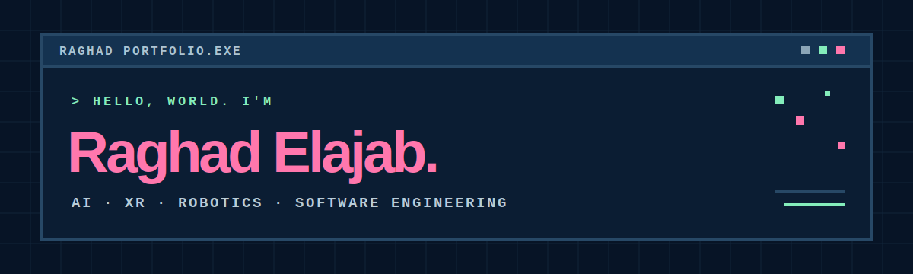
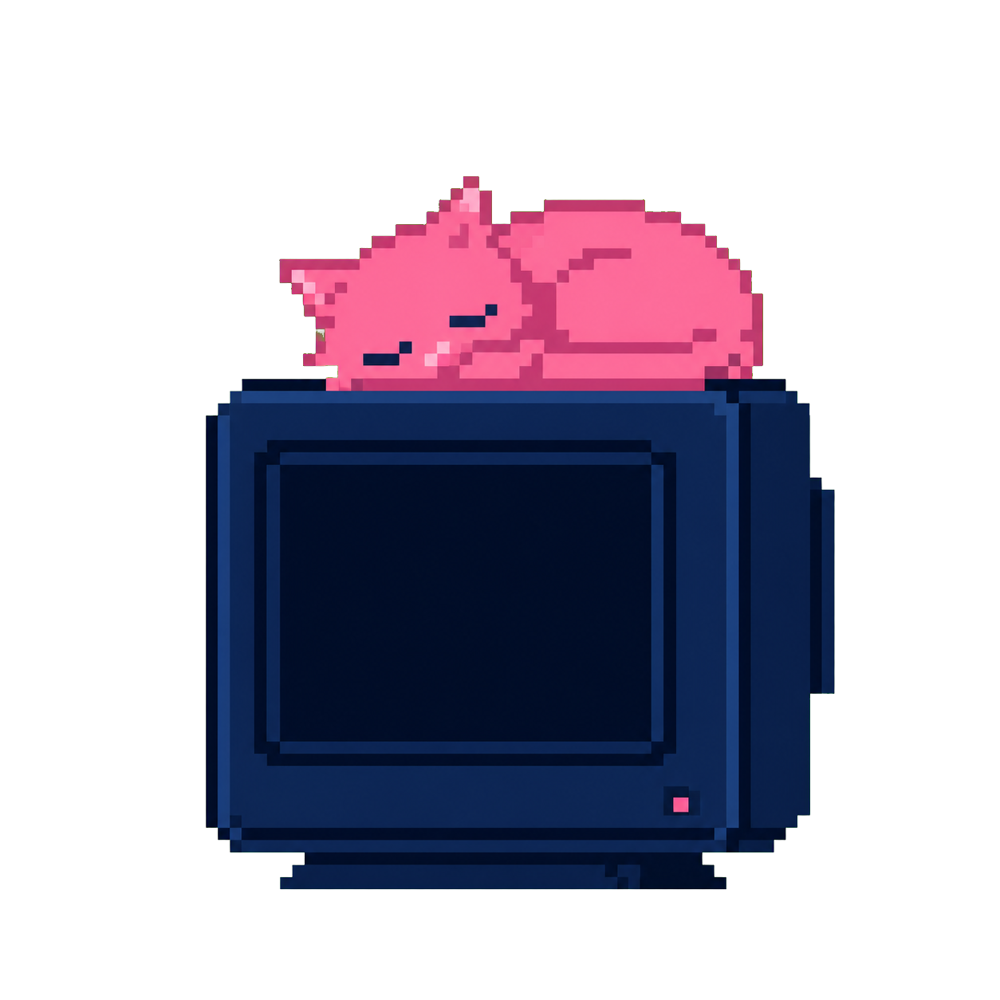

<p align="center">
  
</p>

<p align="center">
  
</p>

<p align="center">
  <strong>Welcome to my little corner of the internet!</strong><br>
  A playful, pixel-art portfolio where I share the intelligent systems, immersive experiences, and software projects I have enjoyed building.
</p>

<p align="center">
  <a href="https://raghadelajab.github.io/portfolio/"><strong>Enter the portfolio ↗</strong></a>
  &nbsp;·&nbsp;
  <a href="https://github.com/RaghadElajab">GitHub</a>
  &nbsp;·&nbsp;
  <a href="https://www.linkedin.com/in/raghad-elajab/">LinkedIn</a>
</p>

## About the portfolio

This is the personal portfolio of **Raghad Elajab**, a Computer Science student at Khalifa University interested in AI, XR, robotics, and software engineering.

The site combines a dark-blue laboratory setting with pink pixel cats and minimal desktop-inspired windows. It is intentionally lightweight and built without a framework.

## What you can explore

- AI and computer-vision work, including a FaceNet and SVM attendance system
- Mixed-reality gardening experiences developed for Microsoft HoloLens
- Deep-learning experiments for crop disease classification
- Machine-learning, systems programming, and Java software projects
- Project demos and result graphs in draggable, resizable mini-player windows
- Experience, technical skills, leadership milestones, and contact links

## Built with

`HTML` · `CSS` · `JavaScript` · a lot of dark blue · a little pink · several pixel cats

## Run it locally

The portfolio has no build step or external dependencies. Clone the repository and open `index.html`, or start a small static server:

```powershell
python -m http.server 8000
```

Then visit `http://localhost:8000`.

## Project map

```text
portfolio/
├── assets/          # Pixel artwork, cats, and project result visuals
├── index.html       # Portfolio content and structure
├── styles.css       # Main visual system
├── overrides.css    # Interactive and responsive refinements
└── script.js        # Windows, mini-players, filters, and interactions
```

## Say hello

I am always happy to connect about AI, XR, robotics, software projects, and new opportunities.

**[raghadelajab@gmail.com](mailto:raghadelajab@gmail.com)**

<p align="center">
  <sub>Designed and built by Raghad Elajab · Abu Dhabi, UAE</sub>
</p>
